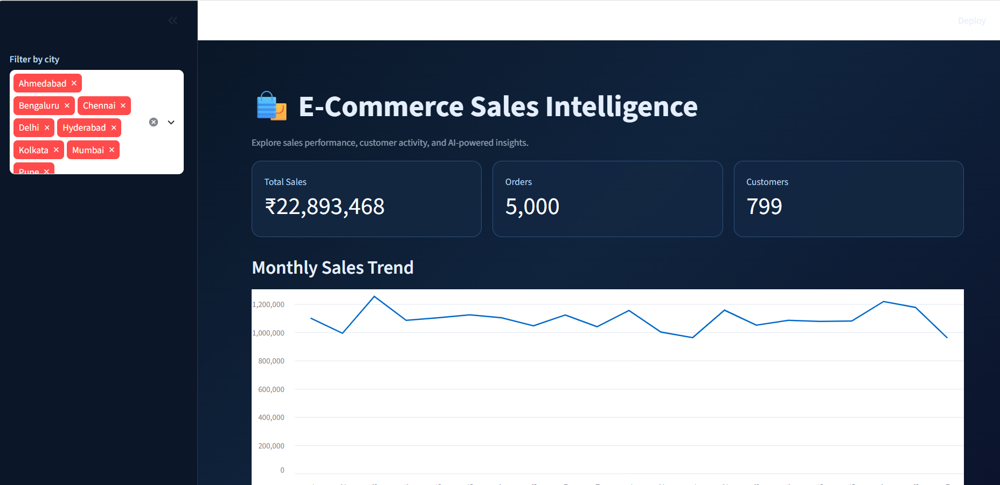
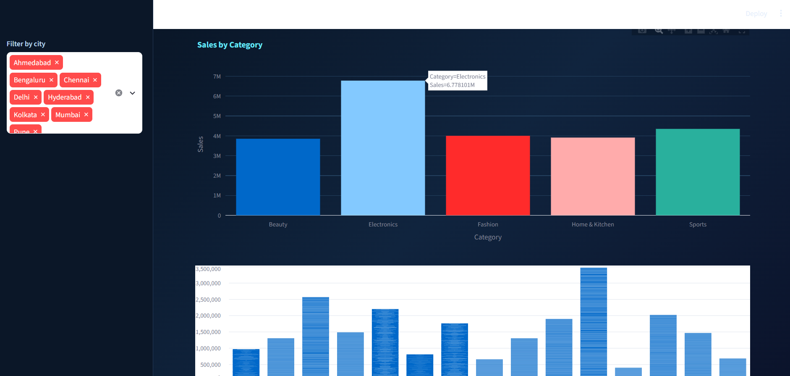
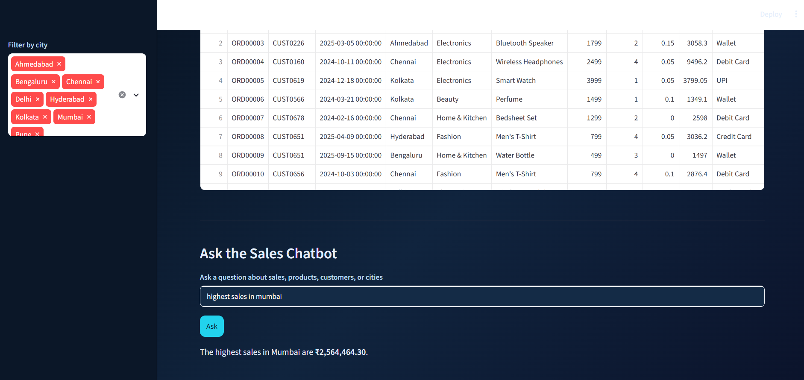

# AI-Powered E-Commerce Sales Intelligence Dashboard

An AI-powered e-commerce sales analytics application built with Python and Streamlit. The project combines interactive data analysis, Plotly visualizations, filtering capabilities, and a Groq-powered chatbot to explore e-commerce sales data.

## Project Overview

This project analyzes e-commerce sales data and presents business insights through an interactive dashboard.

The application allows users to explore sales performance across products, categories, cities, payment methods, and other business dimensions while also interacting with an AI chatbot.

## Key Features

- Interactive e-commerce sales dashboard
- Sales and business performance analysis
- Interactive filters for data exploration
- Plotly-based data visualizations
- Product and category analysis
- City-wise sales analysis
- Payment method analysis
- Delivery performance analysis
- Groq-powered AI chatbot
- CSV-based sales data processing

## Technologies Used

- Python
- Pandas
- Plotly
- Streamlit
- Groq API
- Python-dotenv

## Dataset

The project uses an e-commerce sales dataset containing 5,000 records and 12 columns.

The dataset includes:

- Order ID
- Customer ID
- Order Date
- City
- Category
- Product
- Unit Price
- Quantity
- Discount
- Sales
- Payment Method
- Delivery Days

## Project Structure

```text
AI-Ecommerce-Sales-Intelligence/
├── app.py
├── ecommerce_sales_data.csv
├── generate_data.py
├── requirements.txt
├── .gitignore
└── README.md
```

## How to Run

### 1. Clone the repository

```bash
git clone https://github.com/sahararampal/ai-ecommerce-sales-intelligence.git
```

### 2. Navigate to the project folder

```bash
cd ai-ecommerce-sales-intelligence
```

### 3. Install dependencies

```bash
pip install -r requirements.txt
```

### 4. Configure the Groq API key

Create a `.env` file in the project folder and add your Groq API key:

```text
GROQ_API_KEY2=your_api_key_here
```

### 5. Run the Streamlit application

```bash
streamlit run app.py
```

## Skills Demonstrated

- Data Analysis
- Data Cleaning and Preparation
- Data Visualization
- Exploratory Data Analysis
- Interactive Dashboard Development
- Business Intelligence
- Python Programming
- Pandas
- Plotly
- Streamlit
- LLM Integration
- API Integration

## Dashboard Screenshots

### Dashboard Overview



### Sales Analytics



### Data & AI Sales Chatbot



## Author

**Sahara Rampal**

Data Analytics | Python | SQL | Power BI | Streamlit | LLM Applications
